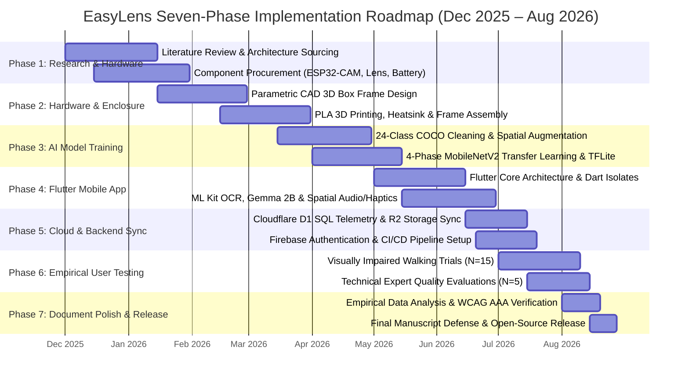
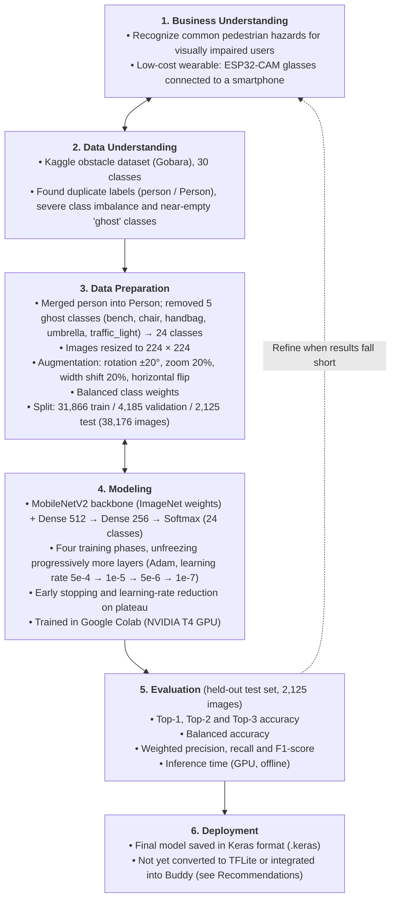

# Chapter 3: Research Methodology & Lifecycle Models

---

## Figure 3.1: EasyLens Project Implementation Timeline and Seven-Phase Activity Roadmap

### APA 7th Citation & Metadata
- **Figure Number**: Figure 3.1
- **Figure Title**: *EasyLens Project Implementation Timeline and Seven-Phase Activity Roadmap*
- **Manuscript Page**: 42
- **PDF Page**: 49
- **Image Asset**: [fig_3_1_timeline_roadmap.png](file:///Users/arronkianparejas/easylens/docs/figures/assets/fig_3_1_timeline_roadmap.png)

```
Figure 3.1
EasyLens Project Implementation Timeline and Seven-Phase Activity Roadmap

Note. Figure 3.1 represents the chronological Gantt chart mapping out the hardware prototyping, machine learning engineering, mobile software construction, empirical walking evaluations, and thesis document finalization phases executed between December 2025 and August 2026.
```

---

### Technical Diagram (Mermaid)



---

## Figure 3.2: The Six-Phase Cross-Industry Standard Process for Data Mining (CRISP-DM) Lifecycle for EasyLens AI Development

### APA 7th Citation & Metadata
- **Figure Number**: Figure 3.2
- **Figure Title**: *The Six-Phase Cross-Industry Standard Process for Data Mining (CRISP-DM) Lifecycle for EasyLens AI Development*
- **Manuscript Page**: 43
- **PDF Page**: 50
- **Image Asset**: [fig_crisp_dm_lifecycle.png](assets/fig_crisp_dm_lifecycle.png)

```
Figure 3.2
The Six-Phase Cross-Industry Standard Process for Data Mining (CRISP-DM) Lifecycle for EasyLens AI Development

Note. Figure 3.2 shows the six CRISP-DM phases followed to develop the custom 24-class MobileNetV2 classifier, from business and data understanding through data preparation, modeling and evaluation. The deployment phase records that the final model was saved but not yet integrated into the Buddy application.
```

---

### Technical Diagram (Mermaid)



---

### Methodological Narrative & Manuscript Context

The research follows the standardized CRISP-DM framework adapted for resource-constrained edge-AI mobile deployment:
1. **Iterative Alignment**: Data understanding and preparation required extensive cleansing to prevent class imbalance from skewing obstacle detection on mobile hardware.
2. **Deployment Status**: The final Phase 4 model was saved in Keras format after training in Google Colab. It has not been converted to TensorFlow Lite or integrated into the mobile application; live detection in Buddy uses the COCO-pretrained SSD MobileNet model and Google ML Kit.
