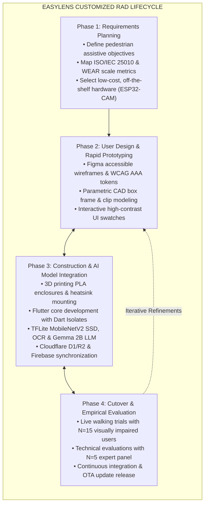
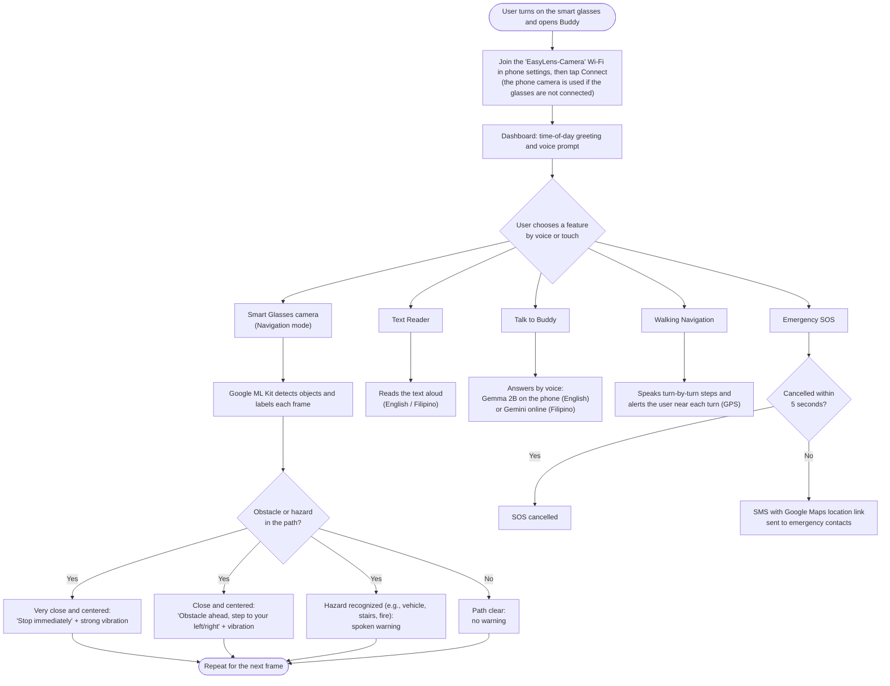

# Chapter 3: Interface Design, RAD Lifecycle & User Journey Flowcharts

---

## Figure 3.7: Side-by-Side Interface Layout of the EasyLens Default Light Theme and High-Contrast AMOLED Black Theme

### APA 7th Citation & Metadata
- **Figure Number**: Figure 3.7
- **Figure Title**: *Side-by-Side Interface Layout of the EasyLens Default Light Theme and High-Contrast AMOLED Black Theme*
- **Manuscript Page**: 67
- **PDF Page**: 74
- **Image Asset**: [fig_3_7_theme_comparison_layout.png](file:///Users/arronkianparejas/easylens/docs/figures/assets/fig_3_7_theme_comparison_layout.png)

```
Figure 3.7
Side-by-Side Interface Layout of the EasyLens Default Light Theme and High-Contrast AMOLED Black Theme

Note. Figure 3.7 illustrates the side-by-side interface layout comparing the default clean light accessibility theme with the high-contrast AMOLED black theme engineered to maximize contrast ratios and reduce photophobia for low-vision users.
```

---

### Contrast Ratios & Color Specification Table

| Interface Element | Default Light Theme Hex | High-Contrast AMOLED Black Hex | Contrast Ratio (vs. Canvas) | WCAG 2.2 Level |
| :--- | :---: | :---: | :---: | :---: |
| **Canvas Background** | `#FFFFFF` | `#000000` | — | Base |
| **Primary Typography** | `#1A1A1A` | `#FFFFFF` | **21.00:1** | AAA (Pass) |
| **Warning / Hazard Highlight** | `#D32F2F` | `#E6E600` (Yellow) | **16.51:1** | AAA (Pass) |
| **Success / Navigation Arrow** | `#2E7D32` | `#33CC33` (Green) | **10.37:1** | AAA (Pass) |
| **Card Surface Border** | `#E0E0E0` | `#FCFCFC` | **16.49:1** | AAA (Pass) |

---

## Figure 3.9: The Customized Rapid Application Development (RAD) Prototyping and Evaluation Lifecycle

### APA 7th Citation & Metadata
- **Figure Number**: Figure 3.9
- **Figure Title**: *The Customized Rapid Application Development (RAD) Prototyping and Evaluation Lifecycle*
- **Manuscript Page**: 98
- **PDF Page**: 105
- **Image Asset**: [fig_3_9_rad_prototyping_lifecycle.png](file:///Users/arronkianparejas/easylens/docs/figures/assets/fig_3_9_rad_prototyping_lifecycle.png)

```
Figure 3.9
The Customized Rapid Application Development (RAD) Prototyping and Evaluation Lifecycle

Note. Figure 3.9 illustrates the customized Rapid Application Development (RAD) lifecycle model incorporating rapid CAD enclosure modeling, continuous machine learning integration, and iterative usability testing with visually impaired participants.
```

---

### Technical Diagram (Mermaid)



---

## Figure 3.10: EasyLens Simplified User Journey and System Interaction Flowchart

### APA 7th Citation & Metadata
- **Figure Number**: Figure 3.10
- **Figure Title**: *EasyLens Simplified User Journey and System Interaction Flowchart*
- **Manuscript Page**: 100
- **PDF Page**: 107
- **Image Asset**: [fig_user_journey_flowchart.png](assets/fig_user_journey_flowchart.png)

```
Figure 3.10
EasyLens Simplified User Journey and System Interaction Flowchart

Note. Figure 3.10 shows the simplified user journey in EasyLens: connecting the smart glasses, choosing a feature by voice or touch, and what each feature does, including the Navigation-mode hazard warnings, Buddy's spoken answers, turn-by-turn walking navigation and the Emergency SOS countdown.
```

---

### Technical Diagram (Mermaid)


