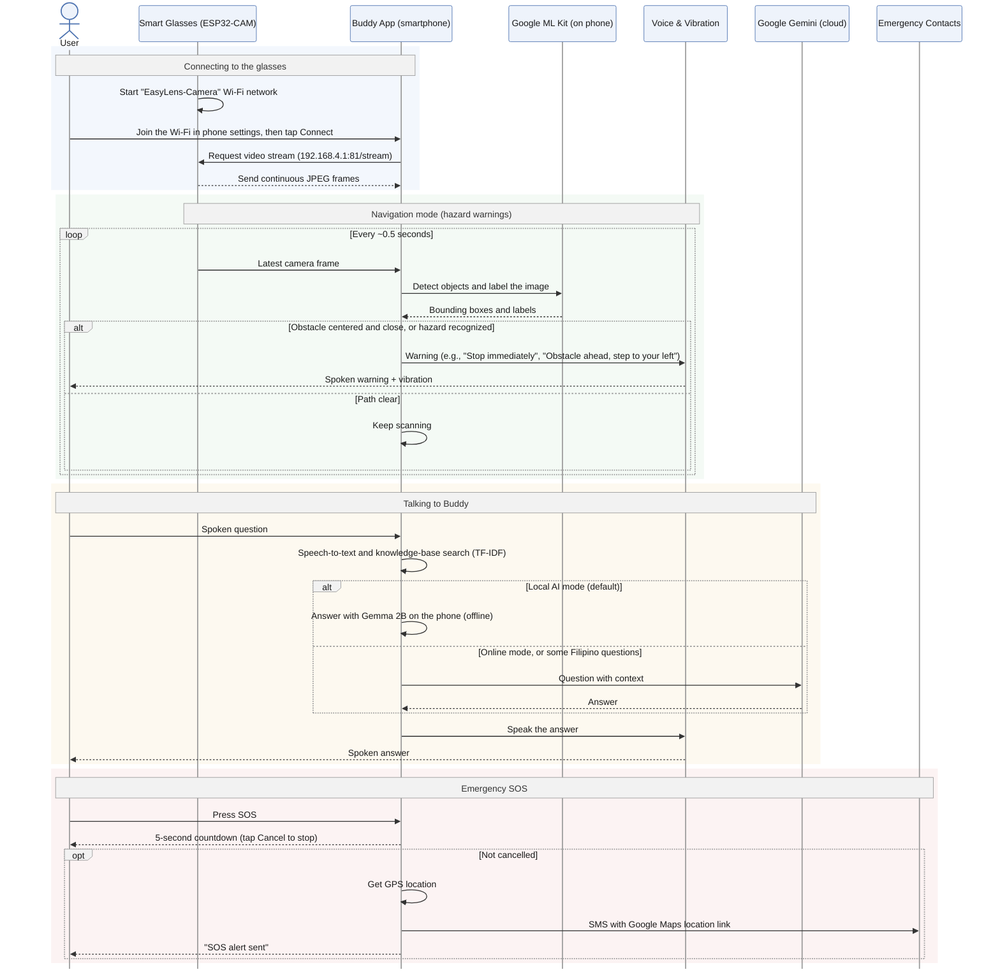

# Chapter 3: System Architecture & UML Sequence Diagram

---

## Figure 3.11: EasyLens System Architecture and Detailed UML Sequence Diagram

### APA 7th Citation & Metadata
- **Figure Number**: Figure 3.11
- **Figure Title**: *EasyLens System Architecture and Detailed UML Sequence Diagram*
- **Manuscript Page**: 102
- **PDF Page**: 109
- **Image Asset**: [fig_system_sequence_diagram.png](assets/fig_system_sequence_diagram.png)

```
Figure 3.11
EasyLens System Architecture and Detailed UML Sequence Diagram

Note. Figure 3.11 shows the EasyLens system architecture as a unified modeling language (UML) sequence diagram: connecting the smart glasses over their local Wi-Fi network, the Navigation-mode hazard-warning loop using Google ML Kit on the phone, Buddy's question-and-answer flow (Gemma 2B on the phone in Local AI mode, the default, or Google Gemini in online mode and for some Filipino questions), and the Emergency SOS flow.
```

---

### Technical Diagram (Mermaid Sequence Diagram)



---

### Architectural Characteristics

1. **Dart Isolate Concurrency**: Offloads raw frame resizing, tensor formatting, and TFLite execution to background threads, guaranteeing that the Flutter UI thread renders at a consistent 60 FPS without frame stutter.
2. **Dual-Tier Large Language Model Orchestration**: Ensures complete offline functionality via the local Gemma-IT 2B INT4 quantized LLM while providing high-quality contextual reasoning via Gemini 3.6 Flash Low when network access is available.
3. **Priority Audio Management**: Audio alerts operate on a strict priority queue where immediate collision and hazard warnings instantly preempt background voice dialogue or navigation prompts.
