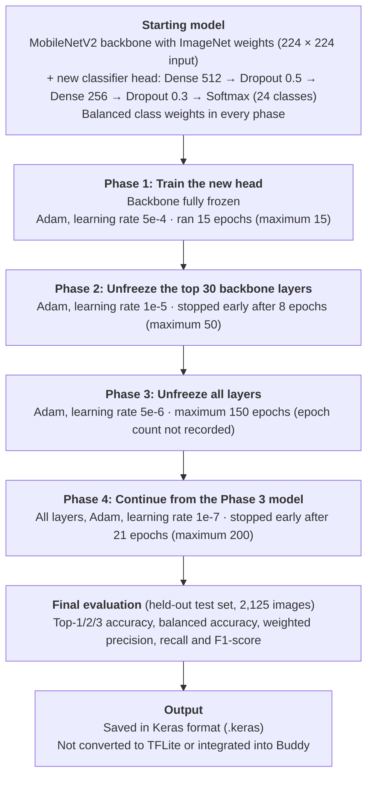
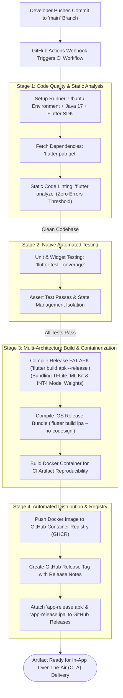
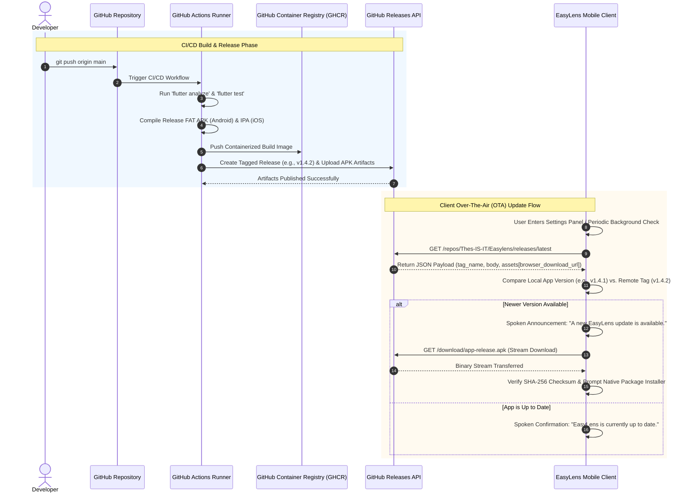

# Chapter 4: Model Training, CI/CD Pipeline & Over-The-Air Update Architecture

---

## Figure 4.1: The Multi-Phase Transfer Learning and Unfreezing Workflow for the MobileNetV2 Classifier

### APA 7th Citation & Metadata
- **Figure Number**: Figure 4.1
- **Figure Title**: *The Multi-Phase Transfer Learning and Unfreezing Workflow for the MobileNetV2 Classifier*
- **Manuscript Page**: 122
- **PDF Page**: 130
- **Image Asset**: [fig_transfer_learning_workflow.png](assets/fig_transfer_learning_workflow.png)

```
Figure 4.1
The Multi-Phase Transfer Learning and Unfreezing Workflow for the MobileNetV2 Classifier

Note. Figure 4.1 shows the four-phase transfer learning workflow used in Google Colab to train the custom 24-class MobileNetV2 image classifier, from training a new classifier head on a frozen ImageNet backbone to fine-tuning all layers at very low learning rates, followed by evaluation on the held-out test set. The final model was saved in Keras format; it was not converted to TFLite or integrated into Buddy.
```

---

### Technical Diagram (Mermaid Flowchart)



---

## Figure 4.2: EasyLens Automated CI/CD Codebase Analysis and Deployment Pipeline Flowchart

### APA 7th Citation & Metadata
- **Figure Number**: Figure 4.2
- **Figure Title**: *EasyLens Automated CI/CD Codebase Analysis and Deployment Pipeline Flowchart*
- **Manuscript Page**: 126
- **PDF Page**: 134
- **Image Asset**: [fig_4_2_cicd_pipeline_flowchart.png](file:///Users/arronkianparejas/easylens/docs/figures/assets/fig_4_2_cicd_pipeline_flowchart.png)

```
Figure 4.2
EasyLens Automated CI/CD Codebase Analysis and Deployment Pipeline Flowchart

Note. Figure 4.2 outlines the automated continuous integration and continuous deployment (CI/CD) pipeline built using GitHub Actions, detailing the static code analysis, native testing, containerized runner compilation, and automated artifact release channels.
```

---

### Technical Diagram (Mermaid Flowchart)



---

## Figure 4.3: Detailed CI/CD Sequence and Over-The-Air (OTA) Application Update Architecture

### APA 7th Citation & Metadata
- **Figure Number**: Figure 4.3
- **Figure Title**: *Detailed CI/CD Sequence and Over-The-Air (OTA) Application Update Architecture*
- **Manuscript Page**: 126
- **PDF Page**: 134–135
- **Image Asset**: [fig_4_3_ota_update_sequence.png](file:///Users/arronkianparejas/easylens/docs/figures/assets/fig_4_3_ota_update_sequence.png)

```
Figure 4.3
Detailed CI/CD Sequence and Over-The-Air (OTA) Application Update Architecture

Note. Figure 4.3 displays the UML sequence diagram and physical interaction loop of the over-the-air (OTA) update system, mapping the network transactions between the Buddy client application and the GitHub Releases API to retrieve stable package versions.
```

---

### Technical Diagram (Mermaid Sequence Diagram)


