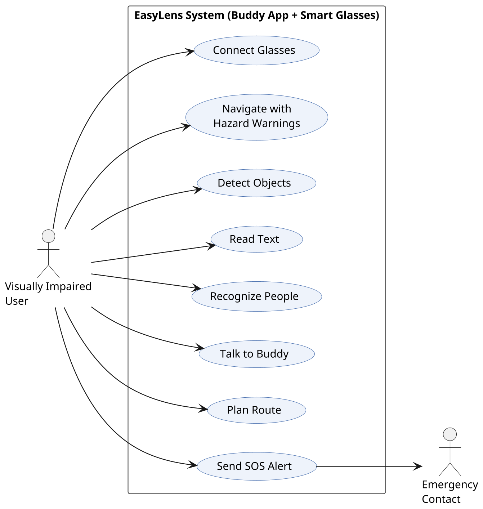
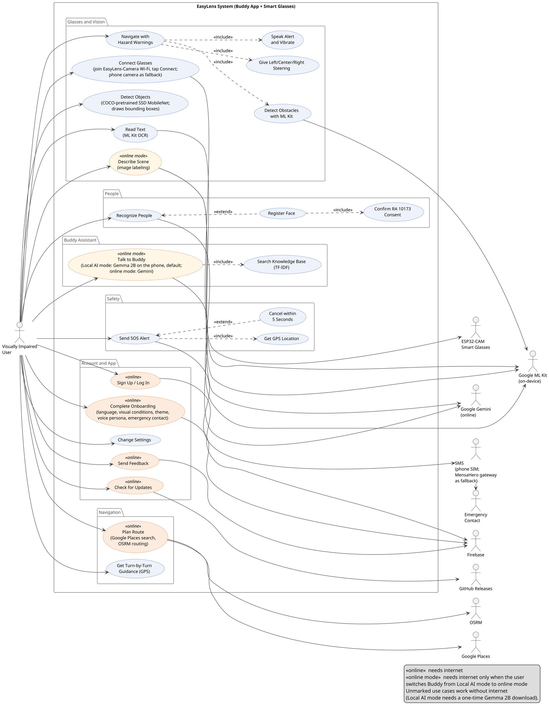

# Appendix D: Use Case Diagrams

Both diagrams are drawn in PlantUML from what the current code does (checked against `upstream/main`, commit `c10062e`). Planned features that are not in the app are left out: the custom 24-class MobileNetV2 classifier, Cloudflare D1 sync, automatic online/offline switching, and distance measurement.

---

## Figure D.1: High-Level Simplified Use Case Diagram

### APA 7th Citation & Metadata
- **Figure Number**: Figure D.1
- **Figure Title**: *High-Level Simplified Use Case Diagram*
- **Image Asset**: [fig_d1_use_case_simplified.png](assets/fig_d1_use_case_simplified.png)

```
Figure D.1
High-Level Simplified Use Case Diagram

Note. Figure D.1 shows the main features the visually impaired user can reach from the Buddy app dashboard. The emergency contact receives the SOS alert.
```

### Source (PlantUML)



---

## Figure D.2: Detailed Architectural Use Case Diagram

### APA 7th Citation & Metadata
- **Figure Number**: Figure D.2
- **Figure Title**: *Detailed Architectural Use Case Diagram*
- **Image Asset**: [fig_d2_use_case_detailed.png](assets/fig_d2_use_case_detailed.png)

```
Figure D.2
Detailed Architectural Use Case Diagram

Note. Figure D.2 shows all user-facing use cases, their «include» and «extend» relationships, and the external systems each one uses. Use cases marked «online» need internet; those marked «online mode» need it only when the user switches Buddy from Local AI mode (the default) to online mode.
```

### Source (PlantUML)



---

## Table D.3: Use Case Descriptions

| Use Case | Primary Actor | Brief Description | Works Offline? |
| :--- | :--- | :--- | :---: |
| Sign Up / Log In | Visually Impaired User | Creates or opens an account with email and password or Google Sign-In through Firebase Authentication. | No |
| Complete Onboarding | Visually Impaired User | Voice-guided sign-up steps: language, visual conditions, mobility aid, contrast theme, voice persona, units and an emergency contact. The answers are saved to Firebase Firestore. | No |
| Change Settings | Visually Impaired User | Changes language, contrast theme, voice persona, units, haptics and voice feedback. Settings are stored on the phone. | Yes |
| Send Feedback | Visually Impaired User | Submits the in-app feedback survey, saved to the Firestore `feedbacks` collection. | No |
| Check for Updates | Visually Impaired User | Asks the GitHub Releases API for the latest release and shows its version, release notes and APK download link. | No |
| Connect Glasses | Visually Impaired User | The user joins the glasses' "EasyLens-Camera" Wi-Fi in phone settings, then taps Connect; the app reads the camera stream at 192.168.4.1:81/stream. The phone camera can be used instead. The glasses' Wi-Fi is local, so no internet is needed. | Yes |
| Navigate with Hazard Warnings | Visually Impaired User | Scans camera frames for obstacles and hazards and warns the user. | Yes |
| Detect Obstacles with ML Kit | (included) | Google ML Kit's on-device object detector and image labeler find obstacles and hazard labels in each frame. | Yes |
| Give Left/Center/Right Steering | (included) | Uses the position and size of the largest detected box to say whether the obstacle is left, center or right, and whether to stop or step aside. | Yes |
| Speak Alert and Vibrate | (included) | Speaks the warning and vibrates the phone (three pulses for critical hazards, one for caution). | Yes |
| Detect Objects | Visually Impaired User | Runs the COCO-pretrained SSD MobileNet model on the phone, draws bounding boxes and announces the objects. | Yes |
| Read Text | Visually Impaired User | Reads printed text aloud using ML Kit on-device text recognition (OCR). | Yes |
| Describe Scene | Visually Impaired User | Combines detected objects and ML Kit image labels into one spoken sentence, written by Gemma 2B in Local AI mode or by Gemini in online mode. | Partly |
| Recognize People | Visually Impaired User | Detects faces with ML Kit and matches them against faces registered on the phone, then announces the person's name. | Yes |
| Register Face | Visually Impaired User | Captures front, left and right views of a person's face and saves the name and face measurements on the phone only. | Yes |
| Confirm RA 10173 Consent | (included) | Requires ticking the Data Privacy Act (RA 10173) consent box before a face can be registered. | Yes |
| Talk to Buddy | Visually Impaired User | Answers spoken questions with Gemma 2B on the phone (Local AI mode, the default) or Google Gemini (online mode, chosen by the user). | Partly |
| Search Knowledge Base (TF-IDF) | (included) | Finds the most relevant entries in Buddy's built-in knowledge base with TF-IDF and adds them to the question. | Yes |
| Plan Route | Visually Impaired User | Searches for the destination with Google Places and gets the route from OSRM. | No |
| Get Turn-by-Turn Guidance | Visually Impaired User | Follows the user's GPS position along the route and speaks each turn. Needs a route already loaded; the map background needs internet. | Partly |
| Send SOS Alert | Visually Impaired User | After a 5-second countdown, sends an SMS with a Google Maps link to the user's location to the emergency contact. It uses the phone's SIM first; the MensaHero internet gateway is only a fallback. | Yes |
| Get GPS Location | (included) | Reads the phone's current GPS position for the SOS message. | Yes |
| Cancel within 5 Seconds | Visually Impaired User | Stops the SOS before it is sent by tapping Cancel during the countdown. | Yes |

*Partly*: Talk to Buddy and Describe Scene work offline in Local AI mode once Gemma 2B (about 1.3 GB) has been downloaded; online mode needs internet. Turn-by-Turn Guidance works offline only after a route has been fetched.
