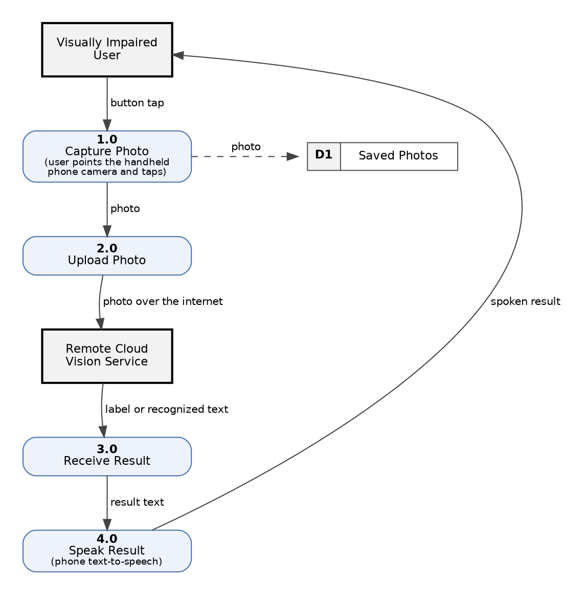

```dot
digraph E2 {
  graph [rankdir=TB, fontname="Helvetica", nodesep=0.45, ranksep=0.7, dpi=200, pad=0.3, bgcolor=white, newrank=true];
  node  [fontname="Helvetica", fontsize=11];
  edge  [fontname="Helvetica", fontsize=9, color="#444444"];

  // External entities
  node [shape=box, style="filled,bold", fillcolor="#F2F2F2", color="#222222", width=1.6];
  Glasses [label="ESP32-CAM Smart Glasses\n(phone camera as fallback)"];
  User    [label="Visually Impaired\nUser"];
  User2   [label="Visually Impaired\nUser"];
  GPS     [label="Phone GPS"];
  Gemini  [label="Google Gemini\n(online mode, some Filipino\nquestions, journal notes)"];
  Notion  [label="Notion\n(feedback copy)"];
  Maps    [label="Google Places\nand OSRM"];
  Firebase[label="Firebase\n(Auth, Firestore)"];
  Contact [label="Emergency\nContact"];
  R2      [label="Cloudflare R2\n(profile photo storage)"];

  // Processes
  node [shape=box, style="rounded,filled", fillcolor="#EEF3FB", color="#4C72B0", fontsize=10.5, width=2.0];
  P1 [label=<<b>1.0</b><br/>Receive Camera Frames<br/><font point-size="8.5">MJPEG over the glasses' own Wi-Fi</font>>];
  P2 [label=<<b>2.0</b><br/>Detect Hazards and Objects<br/><font point-size="8.5">ML Kit object detection and labeling;<br/>SSD MobileNet in Object Detection mode</font>>];
  P3 [label=<<b>3.0</b><br/>Read Text<br/><font point-size="8.5">ML Kit text recognition</font>>];
  P4 [label=<<b>4.0</b><br/>Recognize and Register Faces<br/><font point-size="8.5">ML Kit face detection, on-phone matching</font>>];
  P5 [label=<<b>5.0</b><br/>Answer with Buddy<br/><font point-size="8.5">speech-to-text, TF-IDF search,<br/>Gemma 2B (default) or Gemini</font>>];
  P6 [label=<<b>6.0</b><br/>Speak and Vibrate<br/><font point-size="8.5">text-to-speech, vibration</font>>];
  P7 [label=<<b>7.0</b><br/>Plan and Guide Route>];
  P8 [label=<<b>8.0</b><br/>Send SOS Alert<br/><font point-size="8.5">5-second countdown</font>>];
  P9 [label=<<b>9.0</b><br/>Manage Account and Settings>];

  // Data stores (on the phone)
  node [shape=plaintext, style="", fillcolor=white];
  D1 [label=<<table border="0" cellborder="1" cellspacing="0" cellpadding="5" color="#555555"><tr><td bgcolor="#F2F2F2"><b>D1</b></td><td sides="TBR">Settings and Emergency Contacts (phone)</td></tr></table>>];
  D2 [label=<<table border="0" cellborder="1" cellspacing="0" cellpadding="5" color="#555555"><tr><td bgcolor="#F2F2F2"><b>D2</b></td><td sides="TBR">Registered Faces (phone only)</td></tr></table>>];
  D4 [label=<<table border="0" cellborder="1" cellspacing="0" cellpadding="5" color="#555555"><tr><td bgcolor="#F2F2F2"><b>D4</b></td><td sides="TBR">Interaction Journals (phone)</td></tr></table>>];
  D3 [label=<<table border="0" cellborder="1" cellspacing="0" cellpadding="5" color="#555555"><tr><td bgcolor="#F2F2F2"><b>D3</b></td><td sides="TBR">Buddy Knowledge Base (bundled)</td></tr></table>>];

  // Vision pipeline
  Glasses -> P1 [label="camera frames"];
  P1 -> P2 [label="frame"];
  P1 -> P3 [label="frame"];
  P1 -> P4 [label="frame"];
  P2 -> P6 [label="hazard, direction,\nobject labels"];
  P3 -> P6 [label="recognized text"];
  P4 -> P6 [label="person's name"];
  D2 -> P4 [label="face data"];
  P4 -> D2 [label="new face + name\n(after RA 10173 consent)"];
  P2 -> P5 [label="scene labels\n(Describe Scene)"];

  // Buddy
  User -> P5 [label="spoken question"];
  D3 -> P5 [label="matching entries"];
  P5 -> Gemini [label="question + context\n(+ camera image in online mode);\nexchange for journal note"];
  Gemini -> P5 [label="answer"];
  P5 -> P6 [label="answer text"];
  P5 -> D4 [label="question, answer,\njournal note"];
  D4 -> P5 [label="matching journal entries\n(last 7 days)"];
  P7 -> D4 [label="visited place"];
  P7 -> Firebase [label="recent destinations"];

  // Navigation
  User -> P7 [label="destination"];
  P7 -> Maps [label="search text,\nstart and end points"];
  Maps -> P7 [label="places, route steps"];
  GPS -> P7 [label="position"];
  P7 -> P6 [label="turn instruction"];

  // SOS
  User -> P8 [label="SOS press / cancel"];
  GPS -> P8 [label="position"];
  D1 -> P8 [label="contact numbers"];
  P8 -> Contact [label="SMS with Google Maps link\n(SIM; MensaHero fallback)"];

  // Account
  User -> P9 [label="sign-up answers,\nsettings, feedback"];
  P9 -> D1 [label="settings, contacts"];
  P9 -> Firebase [label="profile, preferences,\ncontacts, feedback"];
  Firebase -> P9 [label="login, saved profile"];
  P9 -> R2 [label="profile photo\n(optional)"];
  P9 -> Notion [label="feedback"];
  D1 -> P6 [label="language, voice"];

  P6 -> User2 [label="speech and vibration"];

  {rank=same; User; Glasses; GPS}
  {rank=sink; User2}
}
```

# Appendix E: Current and Proposed Data Flow Diagrams

Both diagrams are drawn with Graphviz using standard DFD notation: bold squares are external entities, rounded boxes are numbered processes, open-ended boxes (D1–D3) are data stores, and arrows are labeled with the data that moves. Figure E.2 is checked against the current code (`upstream/main`, commit `c10062e`).

---

## Figure E.1: Current Baseline System Detailed Data Flow Diagram

### APA 7th Citation & Metadata
- **Figure Number**: Figure E.1
- **Figure Title**: *Current Baseline System Detailed Data Flow Diagram*
- **Image Asset**: [fig_e_1_baseline_dfd.png](assets/fig_e_1_baseline_dfd.png)

```
Figure E.1
Current Baseline System Detailed Data Flow Diagram

Note. Figure E.1 shows the data flow of a typical handheld, cloud-based assistive app. The user points the phone camera and taps to take a photo, the photo is uploaded to a remote vision service over the internet, and the returned label or text is read aloud. Each result needs a manual capture and an internet connection.
```

### Source (Graphviz)



---

## Figure E.2: Proposed EasyLens Wearable Edge-AI System Detailed Data Flow Diagram

### APA 7th Citation & Metadata
- **Figure Number**: Figure E.2
- **Figure Title**: *Proposed EasyLens Wearable Edge-AI System Detailed Data Flow Diagram*
- **Image Asset**: [fig_e_2_proposed_dfd.png](assets/fig_e_2_proposed_dfd.png)

```
Figure E.2
Proposed EasyLens Wearable Edge-AI System Detailed Data Flow Diagram

Note. Figure E.2 shows how data moves through EasyLens. Camera frames from the smart glasses reach the phone over the glasses' own Wi-Fi and are processed on the phone by Google ML Kit and an SSD MobileNet model. Results are spoken and signaled by vibration. Buddy answers questions with Gemma 2B on the phone by default, or with Google Gemini when the user chooses online mode; some Filipino questions are also sent to Gemini, and each exchange is sent to Gemini to write a short journal note when the phone is online. Buddy's conversations and notes are kept as daily journal files on the phone (D4), and the last seven days are searched together with the knowledge base. Settings, emergency contacts and registered faces are stored on the phone; registered faces are never uploaded. Account data, preferences, emergency contacts, recent destinations and feedback are sent to Firebase, feedback is also copied to Notion, an optional profile photo is stored in Cloudflare R2, and route searches go to Google Places and OSRM. The Visually Impaired User entity appears twice to keep the diagram readable.
```

### Source (Graphviz)


