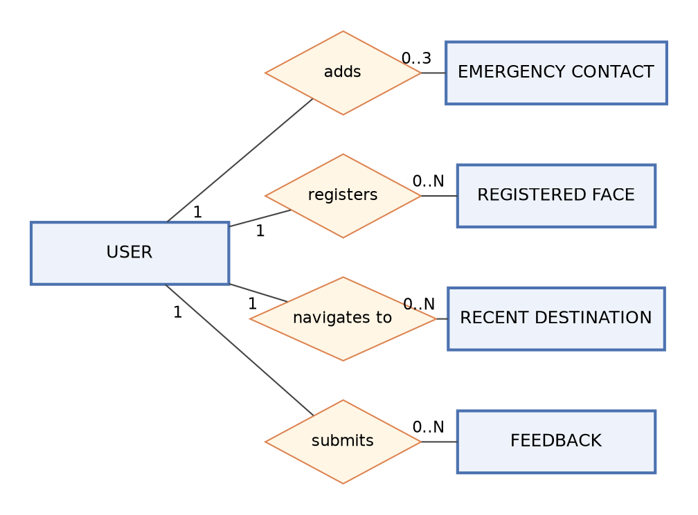
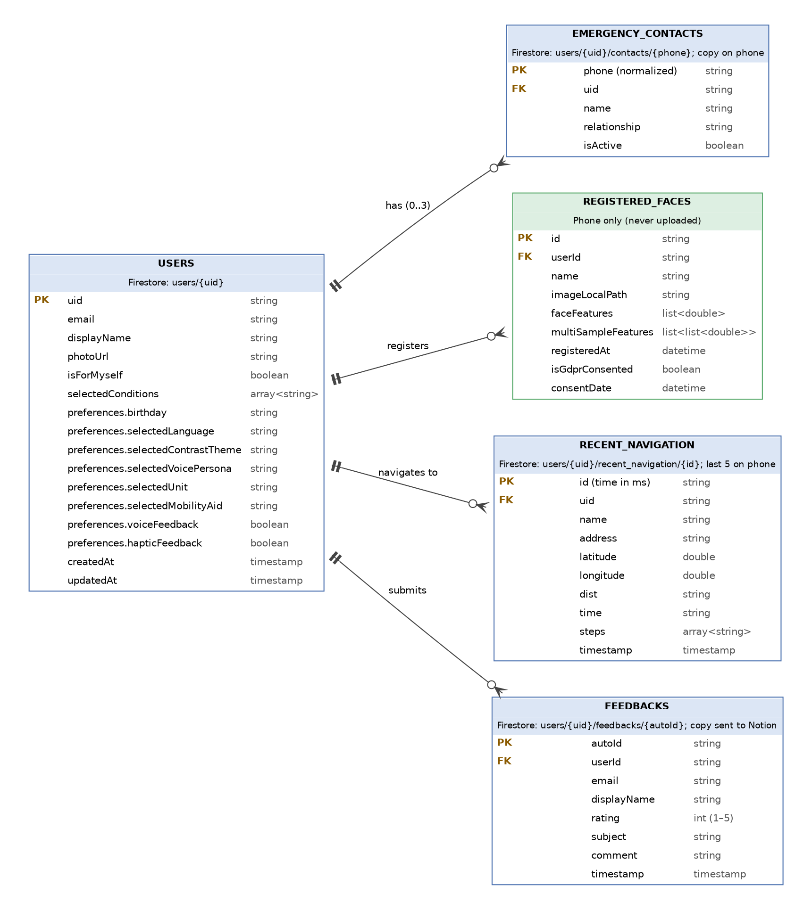

# Appendix F: Entity Relationship Diagrams

Both diagrams show the data EasyLens actually stores, checked against the current code (`upstream/main`, commit `c10062e`). EasyLens has no SQL database: account data is stored in Google Cloud Firestore (a document database), and registered faces, settings and a copy of the emergency contacts are stored on the phone. In Figure F.2, each Firestore subcollection is shown as a table whose foreign key is the parent user document (`users/{uid}`).

---

## Figure F.1: Conceptual Entity Relationship Diagram

### APA 7th Citation & Metadata
- **Figure Number**: Figure F.1
- **Figure Title**: *Conceptual Entity Relationship Diagram*
- **Image Asset**: [fig_f_1_conceptual_erd.png](assets/fig_f_1_conceptual_erd.png)

```
Figure F.1
Conceptual Entity Relationship Diagram

Note. Figure F.1 shows the main data entities in EasyLens and how they relate to the user, in Chen notation. A user can add up to three emergency contacts, and can register any number of faces, navigate to any number of destinations, and submit any number of feedback entries.
```

### Source (Graphviz)



---

## Figure F.2: Relational Entity Relationship Diagram

### APA 7th Citation & Metadata
- **Figure Number**: Figure F.2
- **Figure Title**: *Relational Entity Relationship Diagram*
- **Image Asset**: [fig_f_2_relational_erd.png](assets/fig_f_2_relational_erd.png)

```
Figure F.2
Relational Entity Relationship Diagram

Note. Figure F.2 lists the fields, data types, primary keys (PK) and foreign keys (FK) of each entity, in crow's foot notation, with where each is stored. USERS, EMERGENCY_CONTACTS, RECENT_NAVIGATION and FEEDBACKS are stored in Google Cloud Firestore; emergency contacts and the last five destinations are also kept on the phone. REGISTERED_FACES is stored only on the phone and is never uploaded. Submitted feedback is also copied to a Notion database.
```

### Source (Graphviz)


