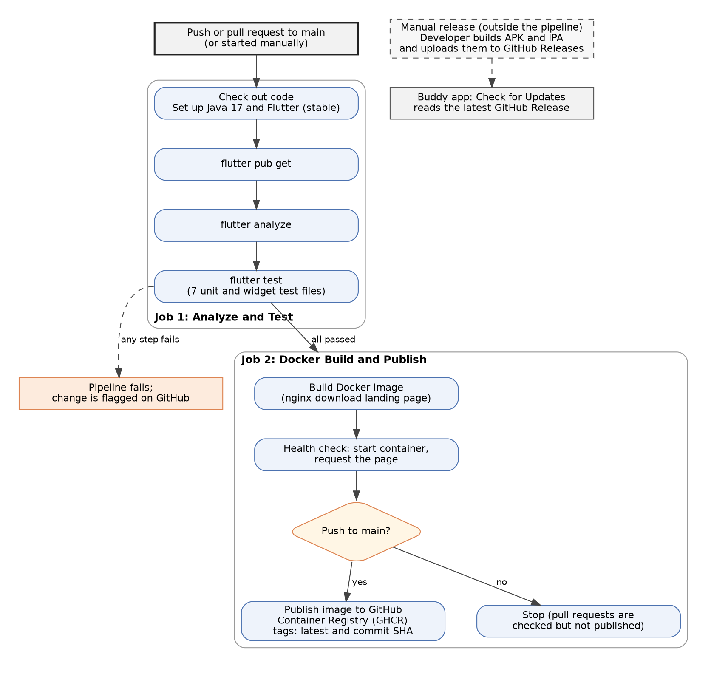

# Appendix S: Continuous Integration and Continuous Deployment (CI/CD) Pipeline

Figure S.1 is drawn from the project's GitHub Actions workflow, `.github/workflows/ci_cd.yml`, with Graphviz.

---

## Figure S.1: CI/CD Pipeline of the EasyLens Project

- **Image Asset**: [fig_s_1_cicd_pipeline.png](assets/fig_s_1_cicd_pipeline.png)

```
Figure S.1
CI/CD Pipeline of the EasyLens Project

Note. The pipeline runs on GitHub Actions for every push and pull request to the main branch, and can also be started manually. The first job installs the app's dependencies, runs static analysis (flutter analyze) and runs the unit and widget tests (flutter test). If these pass, the second job builds a Docker image of the EasyLens download landing page, an nginx web server, and checks that the page responds. For changes pushed to main, the image is published to the GitHub Container Registry (GHCR); pull requests are checked but not published. The pipeline does not build the mobile app: the Android (APK) and iOS (IPA) packages were built and uploaded to GitHub Releases manually, and the app's Check for Updates feature reads the latest release from there.
```

### Source (Graphviz)


